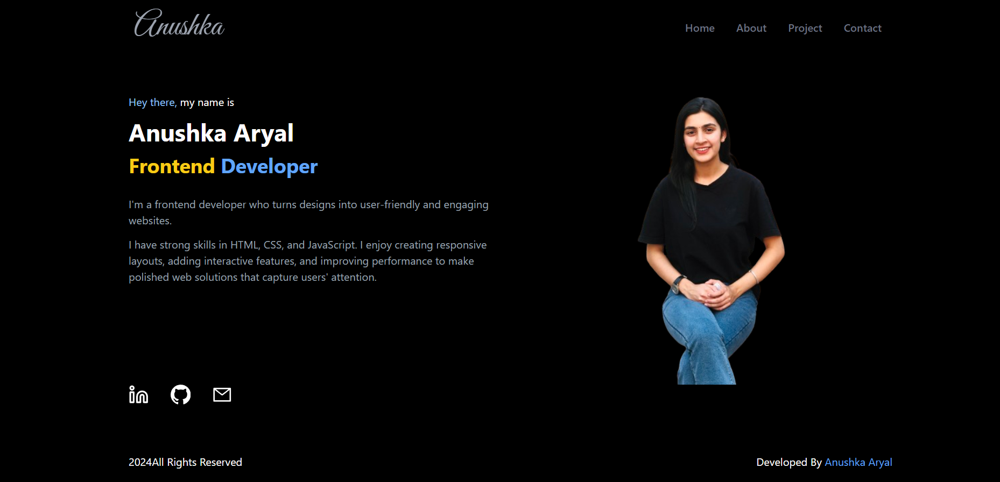

# Personal portfolio website
   
   welcome to my personal portfolio website! Built using HTML, Tailwind CSS, JavaScript, and React, this site showcases my projects, skills, and experiences in a clean and modern interface. Explore my work, learn more about me, and feel free to reach out for collaboration or inquiries. Thank you for visiting! 

## How to access

   You can visit the live site at:
   [https://aryalanushka.vercel.app/]

## Installation

To run this project locally, follow these steps:

**Steps:**
1. Clone the repository: `git clone https://github.com/anushka712/portfolio_website` 

2. Navigate the project directory:`cd portfolio_website`

3. Install dependencies:`npm install`

4. Start the server:`npm run dev`

